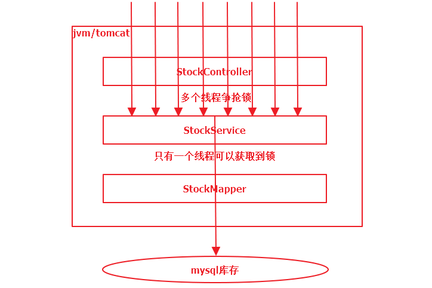
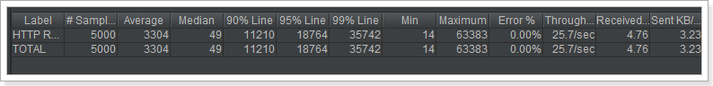

# 分布式锁

在应用开发中，特别是web工程开发，通常都是并发编程，不是多进程就是多线程。这种场景下极易出现线程并发性安全问题，此时不得不使用锁来解决问题。在多线程高并发场景下，为了保证资源的线程安全问题，jdk为我们提供了synchronized关键字和ReentrantLock可重入锁，但是它们只能保证一个工程内的线程安全。在分布式集群、微服务、云原生横行的当下，如何保证不同进程、不同服务、不同机器的线程安全问题，jdk并没有给我们提供既有的解决方案。此时，我们就必须借助于相关技术手动实现了。目前主流的实现有以下方式：

1. 基于mysql关系型实现
2. 基于redis非关系型数据实现
3. 基于zookeeper/etcd实现

本课程将会全面深入、全程手撸代码式的讲解这三种分布式锁的实现。并深入源码讲解第三方分布式锁框架。


基础知识储备及技术要求： 

​	开发工具：idea + jdk1.8
​	工程构建工具：maven 
​	相关框架基础：SpringBoot SpringMVC Spring Mybatis（mybatis-plus） SpringData-Redis
​	数据库：mysql（InnoDB引擎 事务 锁机制） redis
​	负载均衡工具：nginx 
​	压力测试工具：jmeter 
​	其他：zookeeper lua脚本语言 JUC(java.util.concurrent相关背景知识) 微服务相关背景知识


# 1. 传统锁回顾

## 1.1. 从减库存聊起

多线程并发安全问题最典型的代表就是超卖现象

库存在并发量较大情况下很容易发生超卖现象，一旦发生超卖现象，就会出现多成交了订单而发不了货的情况。

场景：

​		商品S库存余量为5时，用户A和B同时来购买一个商品，此时查询库存数都为5，库存充足则开始减库存：

用户A：update db_stock set stock = stock - 1 where id = 1

用户B：update db_stock set stock = stock - 1 where id = 1

并发情况下，更新后的结果可能是4，而实际的最终库存量应该是3才对


## 1.2. 环境准备

建表语句：

```mysql
CREATE TABLE `db_stock` (
  `id` bigint(20) NOT NULL AUTO_INCREMENT,
  `product_code` varchar(255) DEFAULT NULL COMMENT '商品编号',
  `stock_code` varchar(255) DEFAULT NULL COMMENT '仓库编号',
  `count` int(11) DEFAULT NULL COMMENT '库存量',
  PRIMARY KEY (`id`)
) ENGINE=InnoDB AUTO_INCREMENT=1 DEFAULT CHARSET=utf8;
```

表中数据如下：


1001商品在001仓库有5000件库存。


创建分布式锁demo工程：


创建好之后：

 

pom.xml如下：

```xml
<?xml version="1.0" encoding="UTF-8"?>
<project xmlns="http://maven.apache.org/POM/4.0.0" xmlns:xsi="http://www.w3.org/2001/XMLSchema-instance"
         xsi:schemaLocation="http://maven.apache.org/POM/4.0.0 https://maven.apache.org/xsd/maven-4.0.0.xsd">
    <modelVersion>4.0.0</modelVersion>
    <parent>
        <groupId>org.springframework.boot</groupId>
        <artifactId>spring-boot-starter-parent</artifactId>
        <version>2.2.11.RELEASE</version>
        <relativePath/> <!-- lookup parent from repository -->
    </parent>
    <groupId>com.atguigu</groupId>
    <artifactId>distributed-lock</artifactId>
    <version>0.0.1-SNAPSHOT</version>
    <name>distributed-lock</name>
    <description>分布式锁demo工程</description>

    <properties>
        <java.version>1.8</java.version>
    </properties>

    <dependencies>
        <dependency>
            <groupId>org.springframework.boot</groupId>
            <artifactId>spring-boot-starter-web</artifactId>
        </dependency>

        <dependency>
            <groupId>mysql</groupId>
            <artifactId>mysql-connector-java</artifactId>
            <version>5.1.46</version>
        </dependency>

        <dependency>
            <groupId>com.baomidou</groupId>
            <artifactId>mybatis-plus-boot-starter</artifactId>
            <version>3.4.0</version>
        </dependency>

        <dependency>
            <groupId>org.projectlombok</groupId>
            <artifactId>lombok</artifactId>
            <version>1.18.16</version>
        </dependency>
        <dependency>
            <groupId>org.springframework.boot</groupId>
            <artifactId>spring-boot-starter-data-redis</artifactId>
        </dependency>
        
        <dependency>
            <groupId>org.springframework.boot</groupId>
            <artifactId>spring-boot-devtools</artifactId>
        </dependency>
        <dependency>
            <groupId>org.springframework.boot</groupId>
            <artifactId>spring-boot-starter-test</artifactId>
            <scope>test</scope>
            <exclusions>
                <exclusion>
                    <groupId>org.junit.vintage</groupId>
                    <artifactId>junit-vintage-engine</artifactId>
                </exclusion>
            </exclusions>
        </dependency>
    </dependencies>

    <build>
        <plugins>
            <plugin>
                <groupId>org.springframework.boot</groupId>
                <artifactId>spring-boot-maven-plugin</artifactId>
            </plugin>
        </plugins>
    </build>

</project>
```

application.yml配置文件：

```yml
server:
  port: 6000
spring:
  datasource:
    driver-class-name: com.mysql.jdbc.Driver
    url: jdbc:mysql://172.16.116.100:3306/test
    username: root
    password: root
  redis:
    host: 172.16.116.100
```

DistributedLockApplication启动类：

```java
@SpringBootApplication
@MapperScan("com.atguigu.distributedlock.mapper")
public class DistributedLockApplication {

    public static void main(String[] args) {
        SpringApplication.run(DistributedLockApplication.class, args);
    }

}
```

Stock实体类：

```
@Data
@TableName("db_stock")
public class Stock {

    @TableId
    private Long id;

    private String productCode;

    private String stockCode;

    private Integer count;
}
```

StockMapper接口：

```java
public interface StockMapper extends BaseMapper<Stock> {
}
```


## 1.3. 简单实现减库存

接下来咱们代码实操一下。

 

StockController：

```java
@RestController
public class StockController {

    @Autowired
    private StockService stockService;

    @GetMapping("check/lock")
    public String checkAndLock(){

        this.stockService.checkAndLock();

        return "验库存并锁库存成功！";
    }
}
```

StockService：

```java
@Service
public class StockService {

    @Autowired
    private StockMapper stockMapper;

    public void checkAndLock() {

        // 先查询库存是否充足
        Stock stock = this.stockMapper.selectById(1L);

        // 再减库存
        if (stock != null && stock.getCount() > 0){
            stock.setCount(stock.getCount() - 1);
            this.stockMapper.updateById(stock);
        }
    }
}
```

测试：


查看数据库：


在浏览器中一个一个访问时，每访问一次，库存量减1，没有任何问题。


## 1.4. 演示超卖现象

接下来咱们使用jmeter压力测试工具，高并发下压测一下，添加线程组：并发100循环50次，即5000次请求。


给线程组添加HTTP Request请求：


填写测试接口路径如下：


再选择你想要的测试报表，例如这里选择聚合报告：


启动测试，查看压力测试报告：


- Label          取样器别名，如果勾选**Include group name** ，则会添加线程组的名称作为前缀
- \# Samples      取样器运行次数
- Average       请求（事务）的平均响应时间
- Median        中位数
- 90% Line       90%用户响应时间
- 95% Line       90%用户响应时间
- 99% Line       90%用户响应时间
- Min           最小响应时间
- Max           最大响应时间
- Error          错误率
- Throughput     吞吐率
- Received KB/sec  每秒收到的千字节
- Sent KB/sec      每秒收到的千字节

测试结果：请求总数5000次，平均请求时间37ms，中位数（50%）请求是在36ms内完成的，错误率0%，每秒钟平均吞吐量2568.1次。


查看mysql数据库剩余库存数：还有4870


此时如果还有人来下单，就会出现超卖现象（别人购买成功，而无货可发）。


## 1.5. jvm锁问题演示

### 1.5.1. 添加jvm锁

使用jvm锁（synchronized关键字或者ReetrantLock）试试：


重启tomcat服务，再次使用jmeter压力测试，效果如下：


查看mysql数据库：


并没有发生超卖现象，完美解决。


### 1.5.2. 原理

添加synchronized关键字之后，StockService就具备了对象锁，由于添加了独占的排他锁，同一时刻只有一个请求能够获取到锁，并减库存。此时，所有请求只会one-by-one执行下去，也就不会发生超卖现象。




## 1.6. 多服务问题

使用jvm锁在单工程单服务情况下确实没有问题，但是在集群情况下会怎样？

接下启动多个服务并使用nginx负载均衡，结构如下：


启动三个服务（端口号分别8000 8100 8200），如下：


### 1.6.1. 安装配置nginx

基于安装nginx：

```shell
# 拉取镜像
docker pull nginx:latest
# 创建nginx对应资源、日志及配置目录
mkdir -p /opt/nginx/logs /opt/nginx/conf /opt/nginx/html
# 先在conf目录下创建nginx.conf文件，配置内容参照下方
# 再运行容器
docker run -d -p 80:80 --name nginx -v /opt/nginx/html:/usr/share/nginx/html -v /opt/nginx/conf/nginx.conf:/etc/nginx/nginx.conf -v /opt/nginx/logs:/var/log/nginx nginx
```

nginx.conf配置如下：

```nginx
user  nginx;
worker_processes  1;

error_log  /var/log/nginx/error.log warn;
pid        /var/run/nginx.pid;

events {
    worker_connections  1024;
}

http {
    include       /etc/nginx/mime.types;
    default_type  application/octet-stream;

    log_format  main  '$remote_addr - $remote_user [$time_local] "$request" '
                      '$status $body_bytes_sent "$http_referer" '
                      '"$http_user_agent" "$http_x_forwarded_for"';

    access_log  /var/log/nginx/access.log  main;

    sendfile        on;
    #tcp_nopush     on;

    keepalive_timeout  65;

    #gzip  on;

    #include /etc/nginx/conf.d/*.conf;
	
	upstream distributed {
		server 172.16.116.1:8000;
		server 172.16.116.1:8100;
		server 172.16.116.1:8200;
	}
	
	server {
		listen       80;
        server_name  172.16.116.100;
		location / {
			proxy_pass http://distributed;
		}
	}
	
}
```

在浏览器中测试：172.16.116.100是我的nginx服务器地址


经过测试，通过nginx访问服务一切正常。


### 1.6.2. Jmeter压力测试

注意：先把数据库库存量还原到5000。

参照之前的测试用例，再创建一个新的测试组：参数给之前一样


配置nginx的地址及 服务的访问路径如下：


测试结果：性能只是略有提升。


数据库库存剩余量如下：


又出现了并发问题，即出现了超卖现象。


## 1.7. mysql锁演示

除了使用jvm锁之外，还可以使用数据锁：**悲观锁** 或者 **乐观锁**

1. 一个sql：直接更新时判断，在更新中判断库存是否大于0 

   update table set surplus = (surplus - buyQuantity) where id = 1 and (surplus - buyQuantity) > 0 ;

2. 悲观锁：在读取数据时锁住那几行，其他对这几行的更新需要等到悲观锁结束时才能继续 。

   select ... for update

3. 乐观锁：读取数据时不锁，更新时检查是否数据已经被更新过，如果是则取消当前更新进行重试。

   version 或者 时间戳（CAS思想）。


### 1.7.1. 一个sql

略。。


### 1.7.2. 悲观锁

在MySQL的InnoDB中，预设的Tansaction isolation level 为REPEATABLE READ（可重读）

**在SELECT 的读取锁定主要分为两种方式：**

- SELECT ... LOCK IN SHARE MODE　（共享锁）
- SELECT ... FOR UPDATE                     （悲观锁）

这两种方式在事务(Transaction) 进行当中SELECT 到同一个数据表时，都必须等待其它事务数据被提交(Commit)后才会执行。

而主要的不同在于LOCK IN SHARE MODE 在有一方事务要Update 同一个表单时很容易造成死锁。

简单的说，如果SELECT 后面若要UPDATE 同一个表单，最好使用SELECT ... FOR UPDATE。


**代码实现**

改造StockService：


在StockeMapper中定义selectStockForUpdate方法：

```java
public interface StockMapper extends BaseMapper<Stock> {

    public Stock selectStockForUpdate(Long id);
}
```

在StockMapper.xml中定义对应的配置：

```xml
<?xml version="1.0" encoding="UTF-8" ?>
<!DOCTYPE mapper PUBLIC "-//mybatis.org//DTD Mapper 3.0//EN"
        "http://mybatis.org/dtd/mybatis-3-mapper.dtd">
<mapper namespace="com.atguigu.distributedlock.mapper.StockMapper">

    <select id="selectStockForUpdate" resultType="com.atguigu.distributedlock.pojo.Stock">
        select * from db_stock where id = #{id} for update
    </select>
</mapper>
```


**压力测试**

注意：测试之前，需要把库存量改成5000。压测数据如下：比jvm性能高很多，比无锁要低将近1倍


mysql数据库存：


### 1.7.3. 乐观锁

乐观锁（ Optimistic Locking ） 相对悲观锁而言，乐观锁假设认为数据一般情况下不会造成冲突，所以在数据进行提交更新的时候，才会正式对数据的冲突与否进行检测，如果发现冲突了，则重试。那么我们如何实现乐观锁呢

使用数据版本（Version）记录机制实现，这是乐观锁最常用的实现 方式。一般是通过为数据库表增加一个数字类型的 “version” 字段来实现。当读取数据时，将version字段的值一同读出，数据每更新一次，对此version值加一。当我们提交更新的时候，判断数据库表对应记录 的当前版本信息与第一次取出来的version值进行比对，如果数据库表当前版本号与第一次取出来的version值相等，则予以更新。

给db_stock表添加version字段：


对应也需要给Stock实体类添加version属性。此处略。。。。


**代码实现**

```java
public void checkAndLock() {

    // 先查询库存是否充足
    Stock stock = this.stockMapper.selectById(1L);

    // 再减库存
    if (stock != null && stock.getCount() > 0){
        // 获取版本号
        Long version = stock.getVersion();

        stock.setCount(stock.getCount() - 1);
        // 每次更新 版本号 + 1
        stock.setVersion(stock.getVersion() + 1);
        // 更新之前先判断是否是之前查询的那个版本，如果不是重试
        if (this.stockMapper.update(stock, new UpdateWrapper<Stock>().eq("id", stock.getId()).eq("version", version)) == 0) {
            checkAndLock();
        }
    }
}
```

重启后使用jmeter压力测试工具结果如下：


修改测试参数如下：


测试结果如下：


说明乐观锁在并发量越大的情况下，性能越低（因为需要大量的重试）；并发量越小，性能越高。


### 1.7.4. mysql锁总结

性能：一个sql > 悲观锁 > jvm锁 > 乐观锁

如果追求极致性能、业务场景简单并且不需要记录数据前后变化的情况下。

​		优先选择：一个sql

如果写并发量较低（多读），争抢不是很激烈的情况下优先选择：乐观锁

如果写并发量较高，一般会经常冲突，此时选择乐观锁的话，会导致业务代码不间断的重试。

​		优先选择：mysql悲观锁

不推荐jvm本地锁。


## 1.8. redis乐观锁

利用redis监听 + 事务

```shell
watch stock
multi
set stock 5000
exec
```

如果执行过程中stock的值没有被其他链接改变，则执行成功

 

如果执行过程中stock的值被改变，则执行失败效果如下：

 


具体代码实现，只需要改造对应的service方法：

```java
public void deduct() {

    this.redisTemplate.execute(new SessionCallback() {
        @Override
        public Object execute(RedisOperations operations) throws DataAccessException {
            operations.watch("stock");
            // 1. 查询库存信息
            Object stock = operations.opsForValue().get("stock");
            // 2. 判断库存是否充足
            int st = 0;
            if (stock != null && (st = Integer.parseInt(stock.toString())) > 0) {
                // 3. 扣减库存
                operations.multi();
                operations.opsForValue().set("stock", String.valueOf(--st));
                List exec = operations.exec();
                if (exec == null || exec.size() == 0) {
                    try {
                        Thread.sleep(50);
                    } catch (InterruptedException e) {
                        e.printStackTrace();
                    }
                    deduct();
                }
                return exec;
            }
            return null;
        }
    });
}
```


# 2. 基于redis实现分布式锁

## 2.1. 基本实现

借助于redis中的命令setnx(key, value)，key不存在就新增，存在就什么都不做。同时有多个客户端发送setnx命令，只有一个客户端可以成功，返回1（true）；其他的客户端返回0（false）。


1. 多个客户端同时获取锁（setnx）
2. 获取成功，执行业务逻辑，执行完成释放锁（del）
3. 其他客户端等待重试


改造StockService方法：

```java
@Service
public class StockService {

    @Autowired
    private StockMapper stockMapper;

    @Autowired
    private StringRedisTemplate redisTemplate;

    public void deduct() {
        // 加锁setnx
        Boolean lock = this.redisTemplate.opsForValue().setIfAbsent("lock", "111");
        // 重试：递归调用
        if (!lock){
            try {
                Thread.sleep(50);
                this.deduct();
            } catch (InterruptedException e) {
                e.printStackTrace();
            }
        } else {
            try {
                // 1. 查询库存信息
                String stock = redisTemplate.opsForValue().get("stock").toString();

                // 2. 判断库存是否充足
                if (stock != null && stock.length() != 0) {
                    Integer st = Integer.valueOf(stock);
                    if (st > 0) {
                        // 3.扣减库存
                        redisTemplate.opsForValue().set("stock", String.valueOf(--st));
                    }
                }
            } finally {
                // 解锁
                this.redisTemplate.delete("lock");
            }
        }
    }
}
```

其中，加锁也可以使用循环：

```java
// 加锁，获取锁失败重试
while (!this.redisTemplate.opsForValue().setIfAbsent("lock", "111")){
    try {
        Thread.sleep(40);
    } catch (InterruptedException e) {
        e.printStackTrace();
    }
}
```

解锁：

```java
// 释放锁
this.redisTemplate.delete("lock");
```

使用Jmeter压力测试如下：


## 2.2. 防死锁


问题：setnx刚刚获取到锁，当前服务器宕机，导致del释放锁无法执行，进而导致锁无法锁无法释放（死锁）

解决：给锁设置过期时间，自动释放锁。

设置过期时间两种方式：

1. 通过expire设置过期时间（缺乏原子性：如果在setnx和expire之间出现异常，锁也无法释放）
2. 使用set指令设置过期时间：set key value ex 3 nx（既达到setnx的效果，又设置了过期时间）


压力测试肯定也没有问题。


## 2.3. 防误删

问题：可能会释放其他服务器的锁。

场景：如果业务逻辑的执行时间是7s。执行流程如下

1. index1业务逻辑没执行完，3秒后锁被自动释放。

2. index2获取到锁，执行业务逻辑，3秒后锁被自动释放。

3. index3获取到锁，执行业务逻辑

4. index1业务逻辑执行完成，开始调用del释放锁，这时释放的是index3的锁，导致index3的业务只执行1s就被别人释放。

   最终等于没锁的情况。

解决：setnx获取锁时，设置一个指定的唯一值（例如：uuid）；释放前获取这个值，判断是否自己的锁


实现如下：


问题：删除操作缺乏原子性。

场景：

1. index1执行删除时，查询到的lock值确实和uuid相等
2. index1执行删除前，lock刚好过期时间已到，被redis自动释放
3. index2获取了lock
4. index1执行删除，此时会把index2的lock删除

解决方案：没有一个命令可以同时做到判断 + 删除，所有只能通过其他方式实现（**LUA脚本**）


## 2.4. redis中的lua脚本

### 2.4.1. 现实问题

redis采用单线程架构，可以保证单个命令的原子性，但是无法保证一组命令在高并发场景下的原子性。例如：


在串行场景下：A和B的值肯定都是3

在并发场景下：A和B的值可能在0-6之间。

极限情况下1：


则A的结果是0，B的结果是3

极限情况下2：


则A和B的结果都是6

如果redis客户端通过lua脚本把3个命令一次性发送给redis服务器，那么这三个指令就不会被其他客户端指令打断。Redis 也保证脚本会以原子性(atomic)的方式执行： 当某个脚本正在运行的时候，不会有其他脚本或 Redis 命令被执行。 这和使用 MULTI/ EXEC 包围的事务很类似。 

但是MULTI/ EXEC方法来使用事务功能，将一组命令打包执行，无法进行业务逻辑的操作。这期间有某一条命令执行报错（例如给字符串自增），其他的命令还是会执行，并不会回滚。


### 2.4.2. lua介绍

Lua 是一种轻量小巧的脚本语言，用标准C语言编写并以源代码形式开放， 其设计目的是为了嵌入应用程序中，从而为应用程序提供灵活的扩展和定制功能。

**设计目的**

​	其设计目的是为了嵌入应用程序中，从而为应用程序提供灵活的扩展和定制功能。

**Lua 特性**

- **轻量级**：它用标准C语言编写并以源代码形式开放，编译后仅仅一百余K，可以很方便的嵌入别的程序里。
- **可扩展**：Lua提供了非常易于使用的扩展接口和机制：由宿主语言(通常是C或C++)提供这些功能，Lua可以使用它们，就像是本来就内置的功能一样。
- 其它特性：
  - 支持面向过程(procedure-oriented)编程和函数式编程(functional programming)；
  - 自动内存管理；只提供了一种通用类型的表（table），用它可以实现数组，哈希表，集合，对象；
  - 语言内置模式匹配；闭包(closure)；函数也可以看做一个值；提供多线程（协同进程，并非操作系统所支持的线程）支持；
  - 通过闭包和table可以很方便地支持面向对象编程所需要的一些关键机制，比如数据抽象，虚函数，继承和重载等。


### 2.4.3. lua基本语法

对lua脚本感兴趣的同学，请移步到官方教程或者《菜鸟教程》。这里仅以redis中可能会用到的部分语法作介绍。

```lua
a = 5               -- 全局变量
local b = 5         -- 局部变量， redis只支持局部变量
a, b = 10, 2*x      -- 等价于       a=10; b=2*x
```

流程控制：

```lua
if( 布尔表达式 1)
then
   --[ 在布尔表达式 1 为 true 时执行该语句块 --]
elseif( 布尔表达式 2)
then
   --[ 在布尔表达式 2 为 true 时执行该语句块 --]
else 
   --[ 如果以上布尔表达式都不为 true 则执行该语句块 --]
end
```


### 2.4.4. redis执行lua脚本 - EVAL指令

在redis中需要通过eval命令执行lua脚本。

格式：

```
EVAL script numkeys key [key ...] arg [arg ...]
script：lua脚本字符串，这段Lua脚本不需要（也不应该）定义函数。
numkeys：lua脚本中KEYS数组的大小
key [key ...]：KEYS数组中的元素
arg [arg ...]：ARGV数组中的元素
```

案例1：基本案例

```shell
EVAL "return 10" 0
```

输出：(integer) 10


案例2：动态传参

```shell
EVAL "return {KEYS[1],KEYS[2],ARGV[1],ARGV[2]}" 5 10 20 30 40 50 60 70 80 90
# 输出：10 20 60 70

EVAL "if KEYS[1] > ARGV[1] then return 1 else return 0 end" 1 10 20
# 输出：0

EVAL "if KEYS[1] > ARGV[1] then return 1 else return 0 end" 1 20 10
# 输出：1
```

传入了两个参数10和20，KEYS的长度是1，所以KEYS中有一个元素10，剩余的一个20就是ARGV数组的元素。


redis.call()中的redis是redis中提供的lua脚本类库，仅在redis环境中可以使用该类库。

案例3：执行redis类库方法

```shell
set aaa 10  -- 设置一个aaa值为10
EVAL "return redis.call('get', 'aaa')" 0
# 通过return把call方法返回给redis客户端，打印："10"
```

注意：**脚本里使用的所有键都应该由 KEYS 数组来传递。**但并不是强制性的，代价是这样写出的脚本不能被 Redis 集群所兼容。


案例4：给redis类库方法动态传参

```shell
EVAL "return redis.call('set', KEYS[1], ARGV[1])" 1 bbb 20
```


学到这里基本可以应付redis分布式锁所需要的脚本知识了。


案例5：pcall函数的使用（了解）

```shell
-- 当call() 在执行命令的过程中发生错误时，脚本会停止执行，并返回一个脚本错误，输出错误信息
EVAL "return redis.call('sets', KEYS[1], ARGV[1]), redis.call('set', KEYS[2], ARGV[2])" 2 bbb ccc 20 30
-- pcall函数不影响后续指令的执行
EVAL "return redis.pcall('sets', KEYS[1], ARGV[1]), redis.pcall('set', KEYS[2], ARGV[2])" 2 bbb ccc 20 30
```

**注意：set方法写成了sets**，肯定会报错。


## 2.5. 使用lua保证删除原子性

删除LUA脚本：

```lua
if redis.call('get', KEYS[1]) == ARGV[1] then return redis.call('del', KEYS[1]) else return 0 end
```


代码实现：

```java
public void deduct() {
    String uuid = UUID.randomUUID().toString();
    // 加锁setnx
    while (!this.redisTemplate.opsForValue().setIfAbsent("lock", uuid, 3, TimeUnit.SECONDS)) {
        // 重试：循环
        try {
            Thread.sleep(50);
        } catch (InterruptedException e) {
            e.printStackTrace();
        }
    }
    try {
        // this.redisTemplate.expire("lock", 3, TimeUnit.SECONDS);
        // 1. 查询库存信息
        String stock = redisTemplate.opsForValue().get("stock").toString();

        // 2. 判断库存是否充足
        if (stock != null && stock.length() != 0) {
            Integer st = Integer.valueOf(stock);
            if (st > 0) {
                // 3.扣减库存
                redisTemplate.opsForValue().set("stock", String.valueOf(--st));
            }
        }
    } finally {
        // 先判断是否自己的锁，再解锁
        String script = "if redis.call('get', KEYS[1]) == ARGV[1] " +
            "then " +
            "   return redis.call('del', KEYS[1]) " +
            "else " +
            "   return 0 " +
            "end";
        this.redisTemplate.execute(new DefaultRedisScript<>(script, Boolean.class), Arrays.asList("lock"), uuid);
    }
}
```


压力测试，库存量也没有问题，截图略过。。。


## 2.6. 可重入锁

由于上述加锁命令使用了 SETNX ，一旦键存在就无法再设置成功，这就导致后续同一线程内继续加锁，将会加锁失败。当一个线程执行一段代码成功获取锁之后，继续执行时，又遇到加锁的子任务代码，可重入性就保证线程能继续执行，而不可重入就是需要等待锁释放之后，再次获取锁成功，才能继续往下执行。

用一段 Java 代码解释可重入：

```java
public synchronized void a() {
    b();
}

public synchronized void b() {
    // pass
}
```

假设 X 线程在 a 方法获取锁之后，继续执行 b 方法，如果此时**不可重入**，线程就必须等待锁释放，再次争抢锁。

锁明明是被 X 线程拥有，却还需要等待自己释放锁，然后再去抢锁，这看起来就很奇怪，我释放我自己~


可重入性就可以解决这个尴尬的问题，当线程拥有锁之后，往后再遇到加锁方法，直接将加锁次数加 1，然后再执行方法逻辑。退出加锁方法之后，加锁次数再减 1，当加锁次数为 0 时，锁才被真正的释放。

可以看到可重入锁最大特性就是计数，计算加锁的次数。所以当可重入锁需要在分布式环境实现时，我们也就需要统计加锁次数。


解决方案：redis + Hash


### 2.6.1. 加锁脚本

Redis 提供了 Hash （哈希表）这种可以存储键值对数据结构。所以我们可以使用 Redis Hash 存储的锁的重入次数，然后利用 lua 脚本判断逻辑。

```lua
if (redis.call('exists', KEYS[1]) == 0 or redis.call('hexists', KEYS[1], ARGV[1]) == 1) 
then
    redis.call('hincrby', KEYS[1], ARGV[1], 1);
    redis.call('expire', KEYS[1], ARGV[2]);
    return 1;
else
	return 0;
end
```

假设值为：KEYS:[lock], ARGV[uuid, expire]

如果锁不存在或者这是自己的锁，就通过hincrby（不存在就新增并加1，存在就加1）获取锁或者锁次数加1。


### 2.6.2. 解锁脚本

```lua
-- 判断 hash set 可重入 key 的值是否等于 0
-- 如果为 nil 代表 自己的锁已不存在，在尝试解其他线程的锁，解锁失败
-- 如果为 0 代表 可重入次数被减 1
-- 如果为 1 代表 该可重入 key 解锁成功
if(redis.call('hexists', KEYS[1], ARGV[1]) == 0) then 
    return nil; 
elseif(redis.call('hincrby', KEYS[1], ARGV[1], -1) > 0) then 
    return 0; 
else 
    redis.call('del', KEYS[1]); 
    return 1; 
end;
```


### 2.6.3. 代码实现

由于加解锁代码量相对较多，这里可以封装成一个工具类：

 

DistributedLockClient工厂类具体实现：

```java
@Component
public class DistributedLockClient {

    @Autowired
    private StringRedisTemplate redisTemplate;

    private String uuid;

    public DistributedLockClient() {
        this.uuid = UUID.randomUUID().toString();
    }

    public DistributedRedisLock getRedisLock(String lockName){
        return new DistributedRedisLock(redisTemplate, lockName, uuid);
    }
}
```

DistributedRedisLock实现如下：

```java
public class DistributedRedisLock implements Lock {

    private StringRedisTemplate redisTemplate;

    private String lockName;

    private String uuid;

    private long expire = 30;

    public DistributedRedisLock(StringRedisTemplate redisTemplate, String lockName, String uuid) {
        this.redisTemplate = redisTemplate;
        this.lockName = lockName;
        this.uuid = uuid;
    }

    @Override
    public void lock() {
        this.tryLock();
    }

    @Override
    public void lockInterruptibly() throws InterruptedException {

    }

    @Override
    public boolean tryLock() {
        try {
            return this.tryLock(-1L, TimeUnit.SECONDS);
        } catch (InterruptedException e) {
            e.printStackTrace();
        }
        return false;
    }

    /**
     * 加锁方法
     * @param time
     * @param unit
     * @return
     * @throws InterruptedException
     */
    @Override
    public boolean tryLock(long time, TimeUnit unit) throws InterruptedException {
        if (time != -1){
            this.expire = unit.toSeconds(time);
        }
        String script = "if redis.call('exists', KEYS[1]) == 0 or redis.call('hexists', KEYS[1], ARGV[1]) == 1 " +
                "then " +
                "   redis.call('hincrby', KEYS[1], ARGV[1], 1) " +
                "   redis.call('expire', KEYS[1], ARGV[2]) " +
                "   return 1 " +
                "else " +
                "   return 0 " +
                "end";
        while (!this.redisTemplate.execute(new DefaultRedisScript<>(script, Boolean.class), Arrays.asList(lockName), getId(), String.valueOf(expire))){
            Thread.sleep(50);
        }
        return true;
    }

    /**
     * 解锁方法
     */
    @Override
    public void unlock() {
        String script = "if redis.call('hexists', KEYS[1], ARGV[1]) == 0 " +
                "then " +
                "   return nil " +
                "elseif redis.call('hincrby', KEYS[1], ARGV[1], -1) == 0 " +
                "then " +
                "   return redis.call('del', KEYS[1]) " +
                "else " +
                "   return 0 " +
                "end";
        Long flag = this.redisTemplate.execute(new DefaultRedisScript<>(script, Long.class), Arrays.asList(lockName), getId());
        if (flag == null){
            throw new IllegalMonitorStateException("this lock doesn't belong to you!");
        }
    }

    @Override
    public Condition newCondition() {
        return null;
    }

    /**
     * 给线程拼接唯一标识
     * @return
     */
    String getId(){
        return uuid + ":" + Thread.currentThread().getId();
    }
}
```


### 2.6.4. 使用及测试

在业务代码中使用：

```java
public void deduct() {
    DistributedRedisLock redisLock = this.distributedLockClient.getRedisLock("lock");
    redisLock.lock();

    try {
        // 1. 查询库存信息
        String stock = redisTemplate.opsForValue().get("stock").toString();

        // 2. 判断库存是否充足
        if (stock != null && stock.length() != 0) {
            Integer st = Integer.valueOf(stock);
            if (st > 0) {
                // 3.扣减库存
                redisTemplate.opsForValue().set("stock", String.valueOf(--st));
            }
        }
    } finally {
        redisLock.unlock();
    }
}
```

测试：


测试可重入性：


## 2.7. 自动续期

lua脚本：

```lua
if(redis.call('hexists', KEYS[1], ARGV[1]) == 1) then 
    redis.call('expire', KEYS[1], ARGV[2]); 
    return 1; 
else 
    return 0; 
end
```

在RedisDistributeLock中添加renewExpire方法：

```java
public class DistributedRedisLock implements Lock {

    private StringRedisTemplate redisTemplate;

    private String lockName;

    private String uuid;

    private long expire = 30;

    public DistributedRedisLock(StringRedisTemplate redisTemplate, String lockName, String uuid) {
        this.redisTemplate = redisTemplate;
        this.lockName = lockName;
        this.uuid = uuid + ":" + Thread.currentThread().getId();
    }

    @Override
    public void lock() {
        this.tryLock();
    }

    @Override
    public void lockInterruptibly() throws InterruptedException {

    }

    @Override
    public boolean tryLock() {
        try {
            return this.tryLock(-1L, TimeUnit.SECONDS);
        } catch (InterruptedException e) {
            e.printStackTrace();
        }
        return false;
    }

    /**
     * 加锁方法
     * @param time
     * @param unit
     * @return
     * @throws InterruptedException
     */
    @Override
    public boolean tryLock(long time, TimeUnit unit) throws InterruptedException {
        if (time != -1){
            this.expire = unit.toSeconds(time);
        }
        String script = "if redis.call('exists', KEYS[1]) == 0 or redis.call('hexists', KEYS[1], ARGV[1]) == 1 " +
                "then " +
                "   redis.call('hincrby', KEYS[1], ARGV[1], 1) " +
                "   redis.call('expire', KEYS[1], ARGV[2]) " +
                "   return 1 " +
                "else " +
                "   return 0 " +
                "end";
        while (!this.redisTemplate.execute(new DefaultRedisScript<>(script, Boolean.class), Arrays.asList(lockName), uuid, String.valueOf(expire))){
            Thread.sleep(50);
        }
        // 加锁成功，返回之前，开启定时器自动续期
        this.renewExpire();
        return true;
    }

    /**
     * 解锁方法
     */
    @Override
    public void unlock() {
        String script = "if redis.call('hexists', KEYS[1], ARGV[1]) == 0 " +
                "then " +
                "   return nil " +
                "elseif redis.call('hincrby', KEYS[1], ARGV[1], -1) == 0 " +
                "then " +
                "   return redis.call('del', KEYS[1]) " +
                "else " +
                "   return 0 " +
                "end";
        Long flag = this.redisTemplate.execute(new DefaultRedisScript<>(script, Long.class), Arrays.asList(lockName), uuid);
        if (flag == null){
            throw new IllegalMonitorStateException("this lock doesn't belong to you!");
        }
    }

    @Override
    public Condition newCondition() {
        return null;
    }

    // String getId(){
    //     return this.uuid + ":" + Thread.currentThread().getId();
    // }

    private void renewExpire(){
        String script = "if redis.call('hexists', KEYS[1], ARGV[1]) == 1 " +
                "then " +
                "   return redis.call('expire', KEYS[1], ARGV[2]) " +
                "else " +
                "   return 0 " +
                "end";
        new Timer().schedule(new TimerTask() {
            @Override
            public void run() {
                if (redisTemplate.execute(new DefaultRedisScript<>(script, Boolean.class), Arrays.asList(lockName), uuid, String.valueOf(expire))) {
                    renewExpire();
                }
            }
        }, this.expire * 1000 / 3);
    }
}
```


在tryLock方法中使用：


构造方法作如下修改：


解锁方法作如下修改：


## 2.8. 手写分步式锁小结

特征：

1. 独占排他：setnx

2. 防死锁：

   redis客户端程序获取到锁之后，立马宕机。给锁添加过期时间

   不可重入：可重入

3. 防误删：

   先判断是否自己的锁才能删除

4. 原子性：

   加锁和过期时间之间：set k v ex 3 nx

   判断和释放锁之间：lua脚本

5. 可重入性：hash（key field value） + lua脚本 

6. 自动续期：Timer定时器 + lua脚本

7. 在集群情况下，导致锁机制失效：

   1. 客户端程序10010，从主中获取锁
   2. 从还没来得及同步数据，主挂了
   3. 于是从升级为主
   4. 客户端程序10086就从新主中获取到锁，导致锁机制失效


锁操作：

加锁：

1. setnx：独占排他   死锁、不可重入、原子性

2. set k v ex 30 nx：独占排他、死锁 		不可重入 

3. hash + lua脚本：可重入锁
   1. 判断锁是否被占用（exists），如果没有被占用则直接获取锁（hset/hincrby）并设置过期时间（expire）
   2. 如果锁被占用，则判断是否当前线程占用的（hexists），如果是则重入（hincrby）并重置过期时间（expire）
   3. 否则获取锁失败，将来代码中重试

4. Timer定时器 + lua脚本：实现锁的自动续期

   判断锁是否自己的锁（hexists == 1），如果是自己的锁则执行expire重置过期时间

解锁 

1. del：导致误删
2. 先判断再删除同时保证原子性：lua脚本
3. hash + lua脚本：可重入 
     	1. 判断当前线程的锁是否存在，不存在则返回nil，将来抛出异常
      2. 存在则直接减1（hincrby -1），判断减1后的值是否为0，为0则释放锁（del），并返回1
      3. 不为0，则返回0

重试：递归 循环 


## 2.9. 红锁算法

redis集群状态下的问题：

1. 客户端A从master获取到锁
2. 在master将锁同步到slave之前，master宕掉了。
3. slave节点被晋级为master节点
4. 客户端B取得了同一个资源被客户端A已经获取到的另外一个锁。

**安全失效**！

解决集群下锁失效，参照redis官方网站针对redlock文档：https://redis.io/topics/distlock

在算法的分布式版本中，我们假设有N个Redis服务器。这些节点是完全独立的，因此我们不使用复制或任何其他隐式协调系统。**前几节已经描述了如何在单个实例中安全地获取和释放锁，在分布式锁算法中，将使用相同的方法在单个实例中获取和释放锁。**将N设置为5是一个合理的值，因此需要在不同的计算机或虚拟机上运行5个Redis主服务器，确保它们以独立的方式发生故障。

为了获取锁，客户端执行以下操作：

1. 客户端以毫秒为单位获取当前时间的时间戳，作为**起始时间**。
2. 客户端尝试在所有N个实例中顺序使用相同的键名、相同的随机值来获取锁定。每个实例尝试获取锁都需要时间，客户端应该设置一个远小于总锁定时间的超时时间。例如，如果自动释放时间为10秒，则**尝试获取锁的超时时间**可能在5到50毫秒之间。这样可以防止客户端长时间与处于故障状态的Redis节点进行通信：如果某个实例不可用，尽快尝试与下一个实例进行通信。
3. 客户端获取当前时间 减去在步骤1中获得的**起始时间**，来计算**获取锁所花费的时间**。当且仅当客户端能够在大多数实例（至少3个）中获取锁时，并且获取锁所花费的总时间小于锁有效时间，则认为已获取锁。
4. 如果获取了锁，则将锁有效时间减去 **获取锁所花费的时间**，如步骤3中所计算。
5. 如果客户端由于某种原因（无法锁定N / 2 + 1个实例或有效时间为负）而未能获得该锁，它将尝试解锁所有实例（即使没有锁定成功的实例）。

每台计算机都有一个本地时钟，我们通常可以依靠不同的计算机来产生很小的时钟漂移。只有在拥有锁的客户端将在锁有效时间内（如步骤3中获得的）减去一段时间（仅几毫秒）的情况下终止工作，才能保证这一点。以补偿进程之间的时钟漂移


当客户端无法获取锁时，它应该在随机延迟后重试，以避免同时获取同一资源的多个客户端之间不同步（这可能会导致脑裂的情况：没人胜）。同样，客户端在大多数Redis实例中尝试获取锁的速度越快，出现裂脑情况（以及需要重试）的窗口就越小，因此理想情况下，客户端应尝试将SET命令发送到N个实例同时使用多路复用。

值得强调的是，对于未能获得大多数锁的客户端，尽快释放（部分）获得的锁有多么重要，这样就不必等待锁定期满才能再次获得锁（但是，如果发生了网络分区，并且客户端不再能够与Redis实例进行通信，则在等待密钥到期时需要付出可用性损失）。


## 2.10. redisson中的分布式锁


​		Redisson是一个在Redis的基础上实现的Java驻内存数据网格（In-Memory Data Grid）。它不仅提供了一系列的分布式的Java常用对象，还提供了许多分布式服务。其中包括(BitSet, Set, Multimap, SortedSet, Map, List, Queue, BlockingQueue, Deque, BlockingDeque, Semaphore, Lock, AtomicLong, CountDownLatch, Publish / Subscribe, Bloom filter, Remote service, Spring cache, Executor service, Live Object service, Scheduler service) Redisson提供了使用Redis的最简单和最便捷的方法。Redisson的宗旨是促进使用者对Redis的关注分离（Separation of Concern），从而让使用者能够将精力更集中地放在处理业务逻辑上。


官方文档地址：https://github.com/redisson/redisson/wiki


### 2.10.1. 可重入锁（Reentrant Lock）

基于Redis的Redisson分布式可重入锁`RLock` Java对象实现了`java.util.concurrent.locks.Lock`接口。

大家都知道，如果负责储存这个分布式锁的Redisson节点宕机以后，而且这个锁正好处于锁住的状态时，这个锁会出现锁死的状态。为了避免这种情况的发生，Redisson内部提供了一个监控锁的看门狗，它的作用是在Redisson实例被关闭前，不断的延长锁的有效期。默认情况下，看门狗检查锁的超时时间是30秒钟，也可以通过修改`Config.lockWatchdogTimeout`来另行指定。

`RLock`对象完全符合Java的Lock规范。也就是说只有拥有锁的进程才能解锁，其他进程解锁则会抛出`IllegalMonitorStateException`错误。

另外Redisson还通过加锁的方法提供了`leaseTime`的参数来指定加锁的时间。超过这个时间后锁便自动解开了。

```java
RLock lock = redisson.getLock("anyLock");
// 最常见的使用方法
lock.lock();

// 加锁以后10秒钟自动解锁
// 无需调用unlock方法手动解锁
lock.lock(10, TimeUnit.SECONDS);

// 尝试加锁，最多等待100秒，上锁以后10秒自动解锁
boolean res = lock.tryLock(100, 10, TimeUnit.SECONDS);
if (res) {
   try {
     ...
   } finally {
       lock.unlock();
   }
}
```


1. 引入依赖

```xml
<dependency>
    <groupId>org.redisson</groupId>
    <artifactId>redisson</artifactId>
    <version>3.11.2</version>
</dependency>
```


2. 添加配置

```java
@Configuration
public class RedissonConfig {

    @Bean
    public RedissonClient redissonClient(){
        Config config = new Config();
        // 可以用"rediss://"来启用SSL连接
        config.useSingleServer().setAddress("redis://172.16.116.100:6379");
        return Redisson.create(config);
    }
}
```


3. 代码中使用

```java
@Autowired
private RedissonClient redissonClient;

public void checkAndLock() {
    // 加锁，获取锁失败重试
    RLock lock = this.redissonClient.getLock("lock");
    lock.lock();

    // 先查询库存是否充足
    Stock stock = this.stockMapper.selectById(1L);
    // 再减库存
    if (stock != null && stock.getCount() > 0){
        stock.setCount(stock.getCount() - 1);
        this.stockMapper.updateById(stock);
    }

    // 释放锁
    lock.unlock();
}
```


4. 压力测试

性能跟我们手写的区别不大。


数据库也没有问题


### 2.10.2. 公平锁（Fair Lock）

基于Redis的Redisson分布式可重入公平锁也是实现了`java.util.concurrent.locks.Lock`接口的一种`RLock`对象。同时还提供了[异步（Async）](http://static.javadoc.io/org.redisson/redisson/3.10.0/org/redisson/api/RLockAsync.html)、[反射式（Reactive）](http://static.javadoc.io/org.redisson/redisson/3.10.0/org/redisson/api/RLockReactive.html)和[RxJava2标准](http://static.javadoc.io/org.redisson/redisson/3.10.0/org/redisson/api/RLockRx.html)的接口。它保证了当多个Redisson客户端线程同时请求加锁时，优先分配给先发出请求的线程。所有请求线程会在一个队列中排队，当某个线程出现宕机时，Redisson会等待5秒后继续下一个线程，也就是说如果前面有5个线程都处于等待状态，那么后面的线程会等待至少25秒。

```java
RLock fairLock = redisson.getFairLock("anyLock");
// 最常见的使用方法
fairLock.lock();

// 10秒钟以后自动解锁
// 无需调用unlock方法手动解锁
fairLock.lock(10, TimeUnit.SECONDS);

// 尝试加锁，最多等待100秒，上锁以后10秒自动解锁
boolean res = fairLock.tryLock(100, 10, TimeUnit.SECONDS);
fairLock.unlock();
```


### 2.10.3. 联锁（MultiLock）

基于Redis的Redisson分布式联锁[`RedissonMultiLock`](http://static.javadoc.io/org.redisson/redisson/3.10.0/org/redisson/RedissonMultiLock.html)对象可以将多个`RLock`对象关联为一个联锁，每个`RLock`对象实例可以来自于不同的Redisson实例。

```java
RLock lock1 = redissonInstance1.getLock("lock1");
RLock lock2 = redissonInstance2.getLock("lock2");
RLock lock3 = redissonInstance3.getLock("lock3");

RedissonMultiLock lock = new RedissonMultiLock(lock1, lock2, lock3);
// 同时加锁：lock1 lock2 lock3
// 所有的锁都上锁成功才算成功。
lock.lock();
...
lock.unlock();
```


### 2.10.4. 红锁（RedLock）

基于Redis的Redisson红锁`RedissonRedLock`对象实现了[Redlock](http://redis.cn/topics/distlock.html)介绍的加锁算法。该对象也可以用来将多个`RLock`对象关联为一个红锁，每个`RLock`对象实例可以来自于不同的Redisson实例。

```java
RLock lock1 = redissonInstance1.getLock("lock1");
RLock lock2 = redissonInstance2.getLock("lock2");
RLock lock3 = redissonInstance3.getLock("lock3");

RedissonRedLock lock = new RedissonRedLock(lock1, lock2, lock3);
// 同时加锁：lock1 lock2 lock3
// 红锁在大部分节点上加锁成功就算成功。
lock.lock();
...
lock.unlock();
```


### 2.10.5. 读写锁（ReadWriteLock）

基于Redis的Redisson分布式可重入读写锁[`RReadWriteLock`](http://static.javadoc.io/org.redisson/redisson/3.4.3/org/redisson/api/RReadWriteLock.html) Java对象实现了`java.util.concurrent.locks.ReadWriteLock`接口。其中读锁和写锁都继承了[RLock](https://github.com/redisson/redisson/wiki/8.-分布式锁和同步器#81-可重入锁reentrant-lock)接口。

分布式可重入读写锁允许同时有多个读锁和一个写锁处于加锁状态。

```java
RReadWriteLock rwlock = redisson.getReadWriteLock("anyRWLock");
// 最常见的使用方法
rwlock.readLock().lock();
// 或
rwlock.writeLock().lock();

// 10秒钟以后自动解锁
// 无需调用unlock方法手动解锁
rwlock.readLock().lock(10, TimeUnit.SECONDS);
// 或
rwlock.writeLock().lock(10, TimeUnit.SECONDS);

// 尝试加锁，最多等待100秒，上锁以后10秒自动解锁
boolean res = rwlock.readLock().tryLock(100, 10, TimeUnit.SECONDS);
// 或
boolean res = rwlock.writeLock().tryLock(100, 10, TimeUnit.SECONDS);
...
lock.unlock();
```


添加StockController方法：

```java
@GetMapping("test/read")
public String testRead(){
    String msg = stockService.testRead();

    return "测试读";
}

@GetMapping("test/write")
public String testWrite(){
    String msg = stockService.testWrite();

    return "测试写";
}
```


添加StockService方法：

```java
public String testRead() {
    RReadWriteLock rwLock = this.redissonClient.getReadWriteLock("rwLock");
    rwLock.readLock().lock(10, TimeUnit.SECONDS);

    System.out.println("测试读锁。。。。");
    // rwLock.readLock().unlock();

    return null;
}

public String testWrite() {
    RReadWriteLock rwLock = this.redissonClient.getReadWriteLock("rwLock");
    rwLock.writeLock().lock(10, TimeUnit.SECONDS);

    System.out.println("测试写锁。。。。");
    // rwLock.writeLock().unlock();

    return null;
}
```


打开开两个浏览器窗口测试：

- 同时访问写：一个写完之后，等待一会儿（约10s），另一个写开始
- 同时访问读：不用等待
- 先写后读：读要等待（约10s）写完成
- 先读后写：写要等待（约10s）读完成


### 2.10.6. 信号量（Semaphore）

基于Redis的Redisson的分布式信号量（[Semaphore](http://static.javadoc.io/org.redisson/redisson/3.10.0/org/redisson/api/RSemaphore.html)）Java对象`RSemaphore`采用了与`java.util.concurrent.Semaphore`相似的接口和用法。同时还提供了[异步（Async）](http://static.javadoc.io/org.redisson/redisson/3.10.0/org/redisson/api/RSemaphoreAsync.html)、[反射式（Reactive）](http://static.javadoc.io/org.redisson/redisson/3.10.0/org/redisson/api/RSemaphoreReactive.html)和[RxJava2标准](http://static.javadoc.io/org.redisson/redisson/3.10.0/org/redisson/api/RSemaphoreRx.html)的接口。

```java
RSemaphore semaphore = redisson.getSemaphore("semaphore");
semaphore.trySetPermits(3);
semaphore.acquire();
semaphore.release();
```


在StockController添加方法：

```java
@GetMapping("test/semaphore")
public String testSemaphore(){
    this.stockService.testSemaphore();

    return "测试信号量";
}
```

在StockService添加方法：

```java
public void testSemaphore() {
    RSemaphore semaphore = this.redissonClient.getSemaphore("semaphore");
    semaphore.trySetPermits(3);
    try {
        semaphore.acquire();

        TimeUnit.SECONDS.sleep(5);
        System.out.println(System.currentTimeMillis());

        semaphore.release();
    } catch (InterruptedException e) {
        e.printStackTrace();
    }
}
```


添加测试用例：并发10次，循环一次


控制台效果：

```
控制台1：
1606960790234
1606960800337
1606960800443
1606960805248

控制台2：
1606960790328
1606960795332
1606960800245

控制台3：
1606960790433
1606960795238
1606960795437
```


由此可知：

1606960790秒有3次请求进来：每个控制台各1次

1606960795秒有3次请求进来：控制台2有1次，控制台3有2次

1606960800秒有3次请求进来：控制台1有2次，控制台2有1次

1606960805秒有1次请求进来：控制台1有1次


### 2.10.7. 闭锁（CountDownLatch）

基于Redisson的Redisson分布式闭锁（[CountDownLatch](http://static.javadoc.io/org.redisson/redisson/3.10.0/org/redisson/api/RCountDownLatch.html)）Java对象`RCountDownLatch`采用了与`java.util.concurrent.CountDownLatch`相似的接口和用法。

```java
RCountDownLatch latch = redisson.getCountDownLatch("anyCountDownLatch");
latch.trySetCount(1);
latch.await();

// 在其他线程或其他JVM里
RCountDownLatch latch = redisson.getCountDownLatch("anyCountDownLatch");
latch.countDown();
```

需要两个方法：一个等待，一个计数countDown


给StockController添加测试方法：

```java
@GetMapping("test/latch")
public String testLatch(){
    this.stockService.testLatch();

    return "班长锁门。。。";
}

@GetMapping("test/countdown")
public String testCountDown(){
    this.stockService.testCountDown();

    return "出来了一位同学";
}
```


给StockService添加测试方法：

```java
public void testLatch() {
    RCountDownLatch latch = this.redissonClient.getCountDownLatch("latch");
    latch.trySetCount(6);

    try {
        latch.await();
    } catch (InterruptedException e) {
        e.printStackTrace();
    }
}

public void testCountDown() {
    RCountDownLatch latch = this.redissonClient.getCountDownLatch("latch");
    latch.trySetCount(6);

    latch.countDown();
}
```


重启测试，打开两个页面：当第二个请求执行6次之后，第一个请求才会执行。


# 3. 基于zookeeper实现分布式锁

实现分布式锁目前有三种流行方案，分别为基于数据库、Redis、Zookeeper的方案。这里主要介绍基于zk怎么实现分布式锁。在实现分布式锁之前，先回顾zookeeper的相关知识点


## 3.1. 知识点回顾

### 3.1.1. 安装启动

安装：把zk安装包上传到/opt目录下，并切换到/opt目录下，执行以下指令

```shell
# 解压
tar -zxvf zookeeper-3.7.0-bin.tar.gz
# 重命名
mv apache-zookeeper-3.7.0-bin/ zookeeper
# 打开zookeeper根目录
cd /opt/zookeeper
# 创建一个数据目录，备用
mkdir data
# 打开zk的配置目录
cd /opt/zookeeper/conf
# copy配置文件，zk启动时会加载zoo.cfg文件
cp zoo_sample.cfg zoo.cfg
# 编辑配置文件
vim zoo.cfg
# 修改dataDir参数为之前创建的数据目录：/opt/zookeeper/data
# 切换到bin目录
cd /opt/zookeeper/bin
# 启动 
./zkServer.sh start
./zkServer.sh status # 查看启动状态
./zkServer.sh stop # 停止
./zkServer.sh restart # 重启
./zkCli.sh # 查看zk客户端
```

如下，说明启动成功：


### 3.1.2. 相关概念

Zookeeper提供一个多层级的节点命名空间（节点称为znode），每个节点都用一个以斜杠（/）分隔的路径表示，而且每个节点都有父节点（根节点除外），非常类似于文件系统。并且每个节点都是唯一的。

znode节点有四种类型：

- **PERSISTENT**：永久节点。客户端与zookeeper断开连接后，该节点依旧存在
- **EPHEMERAL**：临时节点。客户端与zookeeper断开连接后，该节点被删除
- **PERSISTENT_SEQUENTIAL**：永久节点、序列化。客户端与zookeeper断开连接后，该节点依旧存在，只是Zookeeper给该节点名称进行顺序编号
- **EPHEMERAL_SEQUENTIAL**：临时节点、序列化。客户端与zookeeper断开连接后，该节点被删除，只是Zookeeper给该节点名称进行顺序编号

创建这四种节点：

```shell
[zk: localhost:2181(CONNECTED) 0] create /aa test  # 创建持久化节点
Created /aa
[zk: localhost:2181(CONNECTED) 1] create -s /bb test  # 创建持久序列化节点
Created /bb0000000001
[zk: localhost:2181(CONNECTED) 2] create -e /cc test  # 创建临时节点
Created /cc
[zk: localhost:2181(CONNECTED) 3] create -e -s /dd test  # 创建临时序列化节点
Created /dd0000000003
[zk: localhost:2181(CONNECTED) 4] ls /   # 查看某个节点下的子节点
[aa, bb0000000001, cc, dd0000000003, zookeeper]
[zk: localhost:2181(CONNECTED) 5] stat /  # 查看某个节点的状态
cZxid = 0x0
ctime = Thu Jan 01 08:00:00 CST 1970
mZxid = 0x0
mtime = Thu Jan 01 08:00:00 CST 1970
pZxid = 0x5
cversion = 3
dataVersion = 0
aclVersion = 0
ephemeralOwner = 0x0
dataLength = 0
numChildren = 5
[zk: localhost:2181(CONNECTED) 6] get /aa  # 查看某个节点的内容
test
[zk: localhost:2181(CONNECTED) 11] delete /aa  # 删除某个节点
[zk: localhost:2181(CONNECTED) 7] ls /  # 再次查看
[bb0000000001, cc, dd0000000003, zookeeper]
```


事件监听：在读取数据时，我们可以同时对节点设置事件监听，当节点数据或结构变化时，zookeeper会通知客户端。当前zookeeper针对节点的监听有如下四种事件：

1. 节点创建：stat -w /xx

   当/xx节点创建时：NodeCreated

2. 节点删除：stat -w /xx

   当/xx节点删除时：NodeDeleted

3. 节点数据修改：get -w /xx

   当/xx节点数据发生变化时：NodeDataChanged

4. 子节点变更：ls -w /xx

   当/xx节点的子节点创建或者删除时：NodeChildChanged


### 3.1.3. java客户端

ZooKeeper的java客户端有：原生客户端、ZkClient、Curator框架（类似于redisson，有很多功能性封装）。

1. 引入依赖

```xml
<dependency>
    <groupId>org.apache.zookeeper</groupId>
    <artifactId>zookeeper</artifactId>
    <version>3.7.0</version>
</dependency>
```

2. 常用api及其方法

```java
public class ZkTest {

    public static void main(String[] args) throws KeeperException, InterruptedException {

        // 获取zookeeper链接
        CountDownLatch countDownLatch = new CountDownLatch(1);
        ZooKeeper zooKeeper = null;
        try {
            zooKeeper = new ZooKeeper("172.16.116.100:2181", 30000, new Watcher() {
                @Override
                public void process(WatchedEvent event) {
                    if (Event.KeeperState.SyncConnected.equals(event.getState()) 
                            && Event.EventType.None.equals(event.getType())) {
                        System.out.println("获取链接成功。。。。。。" + event);
                        countDownLatch.countDown();
                    }
                }
            });

            countDownLatch.await();
        } catch (Exception e) {
            e.printStackTrace();
        }

        // 创建一个节点，1-节点路径 2-节点内容 3-节点的访问权限 4-节点类型
        // OPEN_ACL_UNSAFE：任何人可以操作该节点
        // CREATOR_ALL_ACL：创建者拥有所有访问权限
        // READ_ACL_UNSAFE: 任何人都可以读取该节点
        // zooKeeper.create("/atguigu/aa", "haha~~".getBytes(), ZooDefs.Ids.OPEN_ACL_UNSAFE, CreateMode.PERSISTENT);
        zooKeeper.create("/test", "haha~~".getBytes(), ZooDefs.Ids.OPEN_ACL_UNSAFE, CreateMode.EPHEMERAL);
        // zooKeeper.create("/atguigu/cc", "haha~~".getBytes(), ZooDefs.Ids.OPEN_ACL_UNSAFE, CreateMode.PERSISTENT_SEQUENTIAL);
        // zooKeeper.create("/atguigu/dd", "haha~~".getBytes(), ZooDefs.Ids.OPEN_ACL_UNSAFE, CreateMode.EPHEMERAL_SEQUENTIAL);
        // zooKeeper.create("/atguigu/dd", "haha~~".getBytes(), ZooDefs.Ids.OPEN_ACL_UNSAFE, CreateMode.EPHEMERAL_SEQUENTIAL);
        // zooKeeper.create("/atguigu/dd", "haha~~".getBytes(), ZooDefs.Ids.OPEN_ACL_UNSAFE, CreateMode.EPHEMERAL_SEQUENTIAL);

        // 判断节点是否存在
        Stat stat = zooKeeper.exists("/test", true);
        if (stat != null){
            System.out.println("当前节点存在！" + stat.getVersion());
        } else {
            System.out.println("当前节点不存在！");
        }

        // 判断节点是否存在，同时添加监听
        zooKeeper.exists("/test", event -> {
        });

        // 获取一个节点的数据
        byte[] data = zooKeeper.getData("/atguigu/ss0000000001", false, null);
        System.out.println(new String(data));

        // 查询一个节点的所有子节点
        List<String> children = zooKeeper.getChildren("/test", false);
        System.out.println(children);

        // 更新
        zooKeeper.setData("/test", "wawa...".getBytes(), stat.getVersion());

        // 删除一个节点
        //zooKeeper.delete("/test", -1);

        if (zooKeeper != null){
            zooKeeper.close();
        }
    }
}
```


## 3.2. 思路分析

分布式锁的步骤：

1. 获取锁：create一个节点
2. 删除锁：delete一个节点
3. 重试：没有获取到锁的请求重试

参照redis分布式锁的特点：

1. 互斥 排他
2. 防死锁：
   1. 可自动释放锁（临时节点） ：获得锁之后客户端所在机器宕机了，客户端没有主动删除子节点；如果创建的是永久的节点，那么这个锁永远不会释放，导致死锁；由于创建的是临时节点，客户端宕机后，过了一定时间zookeeper没有收到客户端的心跳包判断会话失效，将临时节点删除从而释放锁。
   2. 可重入锁：借助于ThreadLocal
3. 防误删：宕机自动释放临时节点，不需要设置过期时间，也就不存在误删问题。
4. 加锁/解锁要具备原子性
5. 单点问题：使用Zookeeper可以有效的解决单点问题，ZK一般是集群部署的。
6. 集群问题：zookeeper集群是强一致性的，只要集群中有半数以上的机器存活，就可以对外提供服务。


## 3.3. 基本实现

实现思路：

1. 多个请求同时添加一个相同的临时节点，只有一个可以添加成功。添加成功的获取到锁
2. 执行业务逻辑
3. 完成业务流程后，删除节点释放锁。


由于zookeeper获取链接是一个耗时过程，这里可以在项目启动时，初始化链接，并且只初始化一次。借助于spring特性，代码实现如下：

```java
@Component
public class ZkClient {

    private static final String connectString = "172.16.116.100:2181";

    private static final String ROOT_PATH = "/distributed";

    private ZooKeeper zooKeeper;

    @PostConstruct
    public void init(){
        try {
            // 连接zookeeper服务器
            this.zooKeeper = new ZooKeeper(connectString, 30000, new Watcher() {
                @Override
                public void process(WatchedEvent event) {
                    System.out.println("获取链接成功！！");
                }
            });

            // 创建分布式锁根节点
            if (this.zooKeeper.exists(ROOT_PATH, false) == null){
                this.zooKeeper.create(ROOT_PATH, null, ZooDefs.Ids.OPEN_ACL_UNSAFE, CreateMode.PERSISTENT);
            }
        } catch (Exception e) {
            System.out.println("获取链接失败！");
            e.printStackTrace();
        }
    }

    @PreDestroy
    public void destroy(){
        try {
            if (zooKeeper != null){
                zooKeeper.close();
            }
        } catch (InterruptedException e) {
            e.printStackTrace();
        }
    }

    /**
     * 初始化zk分布式锁对象方法
     * @param lockName
     * @return
     */
    public ZkDistributedLock getZkDistributedLock(String lockName){
        return new ZkDistributedLock(zooKeeper, lockName);
    }
}
```

zk分布式锁具体实现：

```java
public class ZkDistributedLock {

    private static final String ROOT_PATH = "/distributed";

    private String path;

    private ZooKeeper zooKeeper;

    public ZkDistributedLock(ZooKeeper zooKeeper, String lockName){
        this.zooKeeper = zooKeeper;
        this.path = ROOT_PATH + "/" + lockName;
    }

    public void lock(){
        try {
            zooKeeper.create(path, null, ZooDefs.Ids.OPEN_ACL_UNSAFE, CreateMode.EPHEMERAL);
        } catch (Exception e) {
            // 重试
            try {
                Thread.sleep(200);
                lock();
            } catch (InterruptedException ex) {
                ex.printStackTrace();
            }
        }
    }

    public void unlock(){
        try {
            this.zooKeeper.delete(path, 0);
        } catch (InterruptedException e) {
            e.printStackTrace();
        } catch (KeeperException e) {
            e.printStackTrace();
        }
    }
}
```


改造StockService的checkAndLock方法：

```java
@Autowired
private ZkClient client;

public void checkAndLock() {
    // 加锁，获取锁失败重试
    ZkDistributedLock lock = this.client.getZkDistributedLock("lock");
    lock.lock();

    // 先查询库存是否充足
    Stock stock = this.stockMapper.selectById(1L);
    // 再减库存
    if (stock != null && stock.getCount() > 0){
        stock.setCount(stock.getCount() - 1);
        this.stockMapper.updateById(stock);
    }

    // 释放锁
    lock.unlock();
}
```


Jmeter压力测试：



性能一般，mysql数据库的库存余量为0（注意：所有测试之前都要先修改库存量为5000）


基本实现存在的问题：

1. 性能一般（比mysql分布式锁略好）
2. 不可重入

接下来首先来提高性能


## 3.4. 优化：性能优化

基本实现中由于无限自旋影响性能：


试想：每个请求要想正常的执行完成，最终都是要创建节点，如果能够避免争抢必然可以提高性能。

这里借助于zk的临时序列化节点，实现分布式锁：


### 3.4.1. 实现阻塞锁

代码实现：

```java
public class ZkDistributedLock {

    private static final String ROOT_PATH = "/distributed";

    private String path;

    private ZooKeeper zooKeeper;

    public ZkDistributedLock(ZooKeeper zooKeeper, String lockName){
        try {
            this.zooKeeper = zooKeeper;
            this.path = zooKeeper.create(ROOT_PATH + "/" + lockName + "-", null, ZooDefs.Ids.OPEN_ACL_UNSAFE, CreateMode.EPHEMERAL_SEQUENTIAL);
        } catch (KeeperException e) {
            e.printStackTrace();
        } catch (InterruptedException e) {
            e.printStackTrace();
        }
    }

    public void lock(){
        String preNode = getPreNode(path);
        // 如果该节点没有前一个节点，说明该节点时最小节点，放行执行业务逻辑
        if (StringUtils.isEmpty(preNode)){
            return ;
        }
        // 重新检查。是否获取到锁
        try {
            Thread.sleep(20);
        } catch (InterruptedException ex) {
            ex.printStackTrace();
        }
        lock();
    }

    public void unlock(){
        try {
            this.zooKeeper.delete(path, 0);
        } catch (InterruptedException e) {
            e.printStackTrace();
        } catch (KeeperException e) {
            e.printStackTrace();
        }
    }

    /**
     * 获取指定节点的前节点
     * @param path
     * @return
     */
    private String getPreNode(String path){

        try {
            // 获取当前节点的序列化号
            Long curSerial = Long.valueOf(StringUtils.substringAfterLast(path, "-"));
            // 获取根路径下的所有序列化子节点
            List<String> nodes = this.zooKeeper.getChildren(ROOT_PATH, false);

            // 判空
            if (CollectionUtils.isEmpty(nodes)){
                return null;
            }

            // 获取前一个节点
            Long flag = 0L;
            String preNode = null;
            for (String node : nodes) {
                // 获取每个节点的序列化号
                Long serial = Long.valueOf(StringUtils.substringAfterLast(node, "-"));
                if (serial < curSerial && serial > flag){
                    flag = serial;
                    preNode = node;
                }
            }

            return preNode;
        } catch (KeeperException e) {
            e.printStackTrace();
        } catch (InterruptedException e) {
            e.printStackTrace();
        }
        return null;
    }
}
```


主要修改了构造方法和lock方法：


并添加了getPreNode获取前置节点的方法。


测试结果如下：


性能反而更弱了。

原因：虽然不用反复争抢创建节点了，但是会自旋判断自己是最小的节点，这个判断逻辑反而更复杂更耗时。

解决方案：监听。


### 3.4.2. 监听实现阻塞锁

对于这个算法有个极大的优化点：假如当前有1000个节点在等待锁，如果获得锁的客户端释放锁时，这1000个客户端都会被唤醒，这种情况称为“羊群效应”；在这种羊群效应中，zookeeper需要通知1000个客户端，这会阻塞其他的操作，最好的情况应该只唤醒新的最小节点对应的客户端。应该怎么做呢？在设置事件监听时，每个客户端应该对刚好在它之前的子节点设置事件监听，例如子节点列表为/locks/lock-0000000000、/locks/lock-0000000001、/locks/lock-0000000002，序号为1的客户端监听序号为0的子节点删除消息，序号为2的监听序号为1的子节点删除消息。

所以调整后的分布式锁算法流程如下：

- 客户端连接zookeeper，并在/lock下创建临时的且有序的子节点，第一个客户端对应的子节点为/locks/lock-0000000000，第二个为/locks/lock-0000000001，以此类推；
- 客户端获取/lock下的子节点列表，判断自己创建的子节点是否为当前子节点列表中序号最小的子节点，如果是则认为获得锁，**否则监听刚好在自己之前一位的子节点删除消息**，获得子节点变更通知后重复此步骤直至获得锁；
- 执行业务代码；
- 完成业务流程后，删除对应的子节点释放锁。


改造ZkDistributedLock的lock方法：

```java
public void lock(){
    try {
        String preNode = getPreNode(path);
        // 如果该节点没有前一个节点，说明该节点时最小节点，放行执行业务逻辑
        if (StringUtils.isEmpty(preNode)){
            return ;
        } else {
            CountDownLatch countDownLatch = new CountDownLatch(1);
            if (this.zooKeeper.exists(ROOT_PATH + "/" + preNode, new Watcher(){
                @Override
                public void process(WatchedEvent event) {
                    countDownLatch.countDown();
                }
            }) == null) {
                return;
            }
            // 阻塞。。。。
            countDownLatch.await();
            return;
        }
    } catch (Exception e) {
        e.printStackTrace();
        // 重新检查。是否获取到锁
        try {
            Thread.sleep(200);
        } catch (InterruptedException ex) {
            ex.printStackTrace();
        }
        lock();
    }
}
```


压力测试效果如下：


由此可见性能提高不少，接近于redis的分布式锁


## 3.5. 优化：可重入锁

引入ThreadLocal线程局部变量保证zk分布式锁的可重入性。

```java
public class ZkDistributedLock {

    private static final String ROOT_PATH = "/distributed";
    private static final ThreadLocal<Integer> THREAD_LOCAL = new ThreadLocal<>();

    private String path;

    private ZooKeeper zooKeeper;

    public ZkDistributedLock(ZooKeeper zooKeeper, String lockName){
        try {
            this.zooKeeper = zooKeeper;
            if (THREAD_LOCAL.get() == null || THREAD_LOCAL.get() == 0){
                this.path = zooKeeper.create(ROOT_PATH + "/" + lockName + "-", null, ZooDefs.Ids.OPEN_ACL_UNSAFE, CreateMode.EPHEMERAL_SEQUENTIAL);
            }
        } catch (KeeperException e) {
            e.printStackTrace();
        } catch (InterruptedException e) {
            e.printStackTrace();
        }
    }

    public void lock(){
        Integer flag = THREAD_LOCAL.get();
        if (flag != null && flag > 0) {
            THREAD_LOCAL.set(flag + 1);
            return;
        }
        try {
            String preNode = getPreNode(path);
            // 如果该节点没有前一个节点，说明该节点时最小节点，放行执行业务逻辑
            if (StringUtils.isEmpty(preNode)){
                THREAD_LOCAL.set(1);
                return ;
            } else {
                CountDownLatch countDownLatch = new CountDownLatch(1);
                if (this.zooKeeper.exists(ROOT_PATH + "/" + preNode, new Watcher(){
                    @Override
                    public void process(WatchedEvent event) {
                        countDownLatch.countDown();
                    }
                }) == null) {
                    THREAD_LOCAL.set(1);
                    return;
                }
                // 阻塞。。。。
                countDownLatch.await();
                THREAD_LOCAL.set(1);
                return;
            }
        } catch (Exception e) {
            e.printStackTrace();
            // 重新检查。是否获取到锁
            try {
                Thread.sleep(200);
            } catch (InterruptedException ex) {
                ex.printStackTrace();
            }
            lock();
        }
    }

    public void unlock(){
        try {
            THREAD_LOCAL.set(THREAD_LOCAL.get() - 1);
            if (THREAD_LOCAL.get() == 0) {
                this.zooKeeper.delete(path, 0);
                THREAD_LOCAL.remove();
            }
        } catch (InterruptedException e) {
            e.printStackTrace();
        } catch (KeeperException e) {
            e.printStackTrace();
        }
    }

    /**
     * 获取指定节点的前节点
     * @param path
     * @return
     */
    private String getPreNode(String path){

        try {
            // 获取当前节点的序列化号
            Long curSerial = Long.valueOf(StringUtils.substringAfterLast(path, "-"));
            // 获取根路径下的所有序列化子节点
            List<String> nodes = this.zooKeeper.getChildren(ROOT_PATH, false);

            // 判空
            if (CollectionUtils.isEmpty(nodes)){
                return null;
            }

            // 获取前一个节点
            Long flag = 0L;
            String preNode = null;
            for (String node : nodes) {
                // 获取每个节点的序列化号
                Long serial = Long.valueOf(StringUtils.substringAfterLast(node, "-"));
                if (serial < curSerial && serial > flag){
                    flag = serial;
                    preNode = node;
                }
            }

            return preNode;
        } catch (KeeperException e) {
            e.printStackTrace();
        } catch (InterruptedException e) {
            e.printStackTrace();
        }
        return null;
    }
}
```


## 3.6. zk分布式锁小结

参照redis分布式锁的特点：

1. 互斥 排他：zk节点的不可重复性，以及序列化节点的有序性
2. 防死锁：
   1. 可自动释放锁：临时节点
   2. 可重入锁：借助于ThreadLocal
3. 防误删：临时节点
4. 加锁/解锁要具备原子性
5. 单点问题：使用Zookeeper可以有效的解决单点问题，ZK一般是集群部署的。
6. 集群问题：zookeeper集群是强一致性的，只要集群中有半数以上的机器存活，就可以对外提供服务。
7. 公平锁：有序性节点


## 3.7. Curator中的分布式锁

Curator是netflix公司开源的一套zookeeper客户端，目前是Apache的顶级项目。与Zookeeper提供的原生客户端相比，Curator的抽象层次更高，简化了Zookeeper客户端的开发量。Curator解决了很多zookeeper客户端非常底层的细节开发工作，包括连接重连、反复注册wathcer和NodeExistsException 异常等。

通过查看官方文档，可以发现Curator主要解决了三类问题：

- 封装ZooKeeper client与ZooKeeper server之间的连接处理
- 提供了一套Fluent风格的操作API
- 提供ZooKeeper各种应用场景(recipe， 比如：分布式锁服务、集群领导选举、共享计数器、缓存机制、分布式队列等)的抽象封装，这些实现都遵循了zk的最佳实践，并考虑了各种极端情况

Curator由一系列的模块构成，对于一般开发者而言，常用的是curator-framework和curator-recipes：

- curator-framework：提供了常见的zk相关的底层操作
- curator-recipes：提供了一些zk的典型使用场景的参考。本节重点关注的分布式锁就是该包提供的


引入依赖：

最新版本的curator 4.3.0支持zookeeper 3.4.x和3.5，但是需要注意curator传递进来的依赖，需要和实际服务器端使用的版本相符，以我们目前使用的zookeeper 3.4.14为例。

```xml
<dependency>
    <groupId>org.apache.curator</groupId>
    <artifactId>curator-framework</artifactId>
    <version>4.3.0</version>
    <exclusions>
        <exclusion>
            <groupId>org.apache.zookeeper</groupId>
            <artifactId>zookeeper</artifactId>
        </exclusion>
    </exclusions>
</dependency>
<dependency>
    <groupId>org.apache.curator</groupId>
    <artifactId>curator-recipes</artifactId>
    <version>4.3.0</version>
    <exclusions>
        <exclusion>
            <groupId>org.apache.zookeeper</groupId>
            <artifactId>zookeeper</artifactId>
        </exclusion>
    </exclusions>
</dependency>
<dependency>
    <groupId>org.apache.zookeeper</groupId>
    <artifactId>zookeeper</artifactId>
    <version>3.4.14</version>
</dependency>
```

添加curator客户端配置：

```java
@Configuration
public class CuratorConfig {

    @Bean
    public CuratorFramework curatorFramework(){
        // 重试策略，这里使用的是指数补偿重试策略，重试3次，初始重试间隔1000ms，每次重试之后重试间隔递增。
        RetryPolicy retry = new ExponentialBackoffRetry(1000, 3);
        // 初始化Curator客户端：指定链接信息 及 重试策略
        CuratorFramework client = CuratorFrameworkFactory.newClient("172.16.116.100:2181", retry);
        client.start(); // 开始链接，如果不调用该方法，很多方法无法工作
        return client;
    }
}
```


### 3.7.1. 可重入锁InterProcessMutex

Reentrant和JDK的ReentrantLock类似， 意味着同一个客户端在拥有锁的同时，可以多次获取，不会被阻塞。它是由类**InterProcessMutex**来实现。

```java
// 常用构造方法
public InterProcessMutex(CuratorFramework client, String path)
// 获取锁
public void acquire();
// 带超时时间的可重入锁
public boolean acquire(long time, TimeUnit unit);
// 释放锁
public void release();
```


#### 3.7.1.1. 使用案例

改造service测试方法：

```java
@Autowired
private CuratorFramework curatorFramework;

public void checkAndLock() {
     InterProcessMutex mutex = new InterProcessMutex(curatorFramework, "/curator/lock");
    try {
        // 加锁
        mutex.acquire();

        // 先查询库存是否充足
        Stock stock = this.stockMapper.selectById(1L);
        // 再减库存
        if (stock != null && stock.getCount() > 0){
            stock.setCount(stock.getCount() - 1);
            this.stockMapper.updateById(stock);
        }
        
        // this.testSub(mutex);

        // 释放锁
        mutex.release();
    } catch (Exception e) {
        e.printStackTrace();
    }
}

public void testSub(InterProcessMutex mutex) {

    try {
        mutex.acquire();
    	System.out.println("测试可重入锁。。。。");
        mutex.release();
    } catch (Exception e) {
        e.printStackTrace();
    }
}
```


注意：**如想重入，则需要使用同一个InterProcessMutex对象。**


压力测试结果：


#### 3.7.1.2. 底层原理


### 3.7.2. 不可重入锁InterProcessSemaphoreMutex

具体实现：InterProcessSemaphoreMutex。与InterProcessMutex调用方法类似，区别在于该锁是不可重入的，在同一个线程中不可重入。

```java
public InterProcessSemaphoreMutex(CuratorFramework client, String path);
public void acquire();
public boolean acquire(long time, TimeUnit unit);
public void release();
```


案例：

```java
@Autowired
private CuratorFramework curatorFramework;

public void deduct() {

    InterProcessSemaphoreMutex mutex = new InterProcessSemaphoreMutex(curatorFramework, "/curator/lock");
    try {
        mutex.acquire();
        // 1. 查询库存信息
        String stock = redisTemplate.opsForValue().get("stock").toString();

        // 2. 判断库存是否充足
        if (stock != null && stock.length() != 0) {
            Integer st = Integer.valueOf(stock);
            if (st > 0) {
                // 3.扣减库存
                redisTemplate.opsForValue().set("stock", String.valueOf(--st));
            }
        }
    } catch (Exception e) {
        e.printStackTrace();
    } finally {
        try {
            mutex.release();
        } catch (Exception e) {
            e.printStackTrace();
        }
    }
}
```


### 3.7.3. 可重入读写锁InterProcessReadWriteLock

类似JDK的ReentrantReadWriteLock。一个拥有写锁的线程可重入读锁，但是读锁却不能进入写锁。这也意味着写锁可以降级成读锁。从读锁升级成写锁是不成的。主要实现类InterProcessReadWriteLock：

```java
// 构造方法
public InterProcessReadWriteLock(CuratorFramework client, String basePath);
// 获取读锁对象
InterProcessMutex readLock();
// 获取写锁对象
InterProcessMutex writeLock();
```

注意：**写锁在释放之前会一直阻塞请求线程，而读锁不会**

```java
public void testZkReadLock() {
    try {
        InterProcessReadWriteLock rwlock = new InterProcessReadWriteLock(curatorFramework, "/curator/rwlock");
        rwlock.readLock().acquire(10, TimeUnit.SECONDS);
        // TODO：一顿读的操作。。。。
        //rwlock.readLock().unlock();
    } catch (Exception e) {
        e.printStackTrace();
    }
}

public void testZkWriteLock() {
    try {
        InterProcessReadWriteLock rwlock = new InterProcessReadWriteLock(curatorFramework, "/curator/rwlock");
        rwlock.writeLock().acquire(10, TimeUnit.SECONDS);
        // TODO：一顿写的操作。。。。
        //rwlock.writeLock().unlock();
    } catch (Exception e) {
        e.printStackTrace();
    }
}
```


### 3.7.4. 联锁InterProcessMultiLock

Multi Shared Lock是一个锁的容器。当调用acquire， 所有的锁都会被acquire，如果请求失败，所有的锁都会被release。同样调用release时所有的锁都被release(失败被忽略)。基本上，它就是组锁的代表，在它上面的请求释放操作都会传递给它包含的所有的锁。实现类InterProcessMultiLock：

```java
// 构造函数需要包含的锁的集合，或者一组ZooKeeper的path
public InterProcessMultiLock(List<InterProcessLock> locks);
public InterProcessMultiLock(CuratorFramework client, List<String> paths);

// 获取锁
public void acquire();
public boolean acquire(long time, TimeUnit unit);

// 释放锁
public synchronized void release();
```


### 3.7.5. 信号量InterProcessSemaphoreV2

一个计数的信号量类似JDK的Semaphore。JDK中Semaphore维护的一组许可(permits)，而Cubator中称之为租约(Lease)。注意，所有的实例必须使用相同的numberOfLeases值。调用acquire会返回一个租约对象。客户端必须在finally中close这些租约对象，否则这些租约会丢失掉。但是，如果客户端session由于某种原因比如crash丢掉， 那么这些客户端持有的租约会自动close， 这样其它客户端可以继续使用这些租约。主要实现类InterProcessSemaphoreV2：

```java
// 构造方法
public InterProcessSemaphoreV2(CuratorFramework client, String path, int maxLeases);

// 注意一次你可以请求多个租约，如果Semaphore当前的租约不够，则请求线程会被阻塞。
// 同时还提供了超时的重载方法
public Lease acquire();
public Collection<Lease> acquire(int qty);
public Lease acquire(long time, TimeUnit unit);
public Collection<Lease> acquire(int qty, long time, TimeUnit unit)

// 租约还可以通过下面的方式返还
public void returnAll(Collection<Lease> leases);
public void returnLease(Lease lease);
```


案例代码：

StockController中添加方法：

```java
@GetMapping("test/semaphore")
public String testSemaphore(){
    this.stockService.testSemaphore();
    return "hello Semaphore";
}
```

StockService中添加方法：

```java
public void testSemaphore() {
    // 设置资源量 限流的线程数
    InterProcessSemaphoreV2 semaphoreV2 = new InterProcessSemaphoreV2(curatorFramework, "/locks/semaphore", 5);
    try {
        Lease acquire = semaphoreV2.acquire();// 获取资源，获取资源成功的线程可以继续处理业务操作。否则会被阻塞住
        this.redisTemplate.opsForList().rightPush("log", "10010获取了资源，开始处理业务逻辑。" + Thread.currentThread().getName());
        TimeUnit.SECONDS.sleep(10 + new Random().nextInt(10));
        this.redisTemplate.opsForList().rightPush("log", "10010处理完业务逻辑，释放资源=====================" + Thread.currentThread().getName());
        semaphoreV2.returnLease(acquire); // 手动释放资源，后续请求线程就可以获取该资源
    } catch (Exception e) {
        e.printStackTrace();
    }
}
```


### 3.7.6. 栅栏barrier

1. **DistributedBarrier**构造函数中barrierPath参数用来确定一个栅栏，只要barrierPath参数相同(路径相同)就是同一个栅栏。通常情况下栅栏的使用如下：

   1. 主client设置一个栅栏
   2. 其他客户端就会调用waitOnBarrier()等待栅栏移除，程序处理线程阻塞
   3. 主client移除栅栏，其他客户端的处理程序就会同时继续运行。

   DistributedBarrier类的主要方法如下：

   ```java
   setBarrier() - 设置栅栏
   waitOnBarrier() - 等待栅栏移除
   removeBarrier() - 移除栅栏
   ```

   

2. DistributedDoubleBarrier双栅栏，允许客户端在计算的开始和结束时同步。当足够的进程加入到双栅栏时，进程开始计算，当计算完成时，离开栅栏。DistributedDoubleBarrier实现了双栅栏的功能。构造函数如下：

   ```java
   // client - the client
   // barrierPath - path to use
   // memberQty - the number of members in the barrier
   public DistributedDoubleBarrier(CuratorFramework client, String barrierPath, int memberQty);
   
   enter()、enter(long maxWait, TimeUnit unit) - 等待同时进入栅栏
   leave()、leave(long maxWait, TimeUnit unit) - 等待同时离开栅栏
   ```

   memberQty是成员数量，当enter方法被调用时，成员被阻塞，直到所有的成员都调用了enter。当leave方法被调用时，它也阻塞调用线程，直到所有的成员都调用了leave。

   注意：参数memberQty的值只是一个阈值，而不是一个限制值。当等待栅栏的数量大于或等于这个值栅栏就会打开！

   与栅栏(DistributedBarrier)一样,双栅栏的barrierPath参数也是用来确定是否是同一个栅栏的，双栅栏的使用情况如下：

   1. 从多个客户端在同一个路径上创建双栅栏(DistributedDoubleBarrier),然后调用enter()方法，等待栅栏数量达到memberQty时就可以进入栅栏。
   2. 栅栏数量达到memberQty，多个客户端同时停止阻塞继续运行，直到执行leave()方法，等待memberQty个数量的栅栏同时阻塞到leave()方法中。
   3. memberQty个数量的栅栏同时阻塞到leave()方法中，多个客户端的leave()方法停止阻塞，继续运行。


### 3.7.7. 共享计数器

利用ZooKeeper可以实现一个集群共享的计数器。只要使用相同的path就可以得到最新的计数器值， 这是由ZooKeeper的一致性保证的。Curator有两个计数器， 一个是用int来计数，一个用long来计数。

#### 3.7.7.1. SharedCount

共享计数器SharedCount相关方法如下：

```java
// 构造方法
public SharedCount(CuratorFramework client, String path, int seedValue);
// 获取共享计数的值
public int getCount();
// 设置共享计数的值
public void setCount(int newCount) throws Exception;
// 当版本号没有变化时，才会更新共享变量的值
public boolean  trySetCount(VersionedValue<Integer> previous, int newCount);
// 通过监听器监听共享计数的变化
public void addListener(SharedCountListener listener);
public void addListener(final SharedCountListener listener, Executor executor);
// 共享计数在使用之前必须开启
public void start() throws Exception;
// 关闭共享计数
public void close() throws IOException;
```

使用案例：

StockController：

```java
@GetMapping("test/zk/share/count")
public String testZkShareCount(){
    this.stockService.testZkShareCount();
    return "hello shareData";
}
```

StockService：

```java
public void testZkShareCount() {
    try {
        // 第三个参数是共享计数的初始值
        SharedCount sharedCount = new SharedCount(curatorFramework, "/curator/count", 0);
        // 启动共享计数器
        sharedCount.start();
        // 获取共享计数的值
        int count = sharedCount.getCount();
        // 修改共享计数的值
        int random = new Random().nextInt(1000);
        sharedCount.setCount(random);
        System.out.println("我获取了共享计数的初始值：" + count + "，并把计数器的值改为：" + random);
        sharedCount.close();
    } catch (Exception e) {
        e.printStackTrace();
    }
}
```


#### 3.7.7.2. DistributedAtomicNumber

DistributedAtomicNumber接口是分布式原子数值类型的抽象，定义了分布式原子数值类型需要提供的方法。

DistributedAtomicNumber接口有两个实现：`DistributedAtomicLong` 和 `DistributedAtomicInteger`


这两个实现将各种原子操作的执行委托给了`DistributedAtomicValue`，所以这两种实现是类似的，只不过表示的数值类型不同而已。这里以`DistributedAtomicLong` 为例进行演示

DistributedAtomicLong除了计数的范围比SharedCount大了之外，比SharedCount更简单易用。它首先尝试使用乐观锁的方式设置计数器， 如果不成功(比如期间计数器已经被其它client更新了)， 它使用InterProcessMutex方式来更新计数值。此计数器有一系列的操作：

- get(): 获取当前值
- increment()：加一
- decrement(): 减一
- add()：增加特定的值
- subtract(): 减去特定的值
- trySet(): 尝试设置计数值
- forceSet(): 强制设置计数值

你必须检查返回结果的succeeded()， 它代表此操作是否成功。如果操作成功， preValue()代表操作前的值， postValue()代表操作后的值。


# 4. 基于mysql实现分布式锁

不管是jvm锁还是mysql锁，为了保证线程的并发安全，都提供了悲观独占排他锁。所以**独占排他**也是分布式锁的基本要求。

可以利用唯一键索引不能重复插入的特点实现。设计表如下：

```mysql
CREATE TABLE `tb_lock` (
  `id` bigint(20) NOT NULL AUTO_INCREMENT,
  `lock_name` varchar(50) NOT NULL COMMENT '锁名',
  `class_name` varchar(100) DEFAULT NULL COMMENT '类名',
  `method_name` varchar(50) DEFAULT NULL COMMENT '方法名',
  `server_name` varchar(50) DEFAULT NULL COMMENT '服务器ip',
  `thread_name` varchar(50) DEFAULT NULL COMMENT '线程名',
  `create_time` timestamp NULL DEFAULT NULL ON UPDATE CURRENT_TIMESTAMP COMMENT '获取锁时间',
  `desc` varchar(100) DEFAULT NULL COMMENT '描述',
  PRIMARY KEY (`id`),
  UNIQUE KEY `idx_unique` (`lock_name`)
) ENGINE=InnoDB AUTO_INCREMENT=1332899824461455363 DEFAULT CHARSET=utf8;
```

Lock实体类：

```java
@Data
@AllArgsConstructor
@NoArgsConstructor
@TableName("tb_lock")
public class Lock {

    private Long id;
    private String lockName;
    private String className;
    private String methodName;
    private String serverName;
    private String threadName;
    private Date createTime;
    private String desc;
}
```

LockMapper接口：

```java
public interface LockMapper extends BaseMapper<Lock> {
}
```

## 4.1. 基本思路

synchronized关键字和ReetrantLock锁都是独占排他锁，即多个线程争抢一个资源时，同一时刻只有一个线程可以抢占该资源，其他线程只能阻塞等待，直到占有资源的线程释放该资源。


1. 线程同时获取锁（insert）
2. 获取成功，执行业务逻辑，执行完成释放锁（delete）
3. 其他线程等待重试


## 4.2. 代码实现

改造StockService：

```java
@Service
public class StockService {

    @Autowired
    private StockMapper stockMapper;

    @Autowired
    private LockMapper lockMapper;

    /**
     * 数据库分布式锁
     */
    public void checkAndLock() {

        // 加锁
        Lock lock = new Lock(null, "lock", this.getClass().getName(), new Date(), null);
        try {
            this.lockMapper.insert(lock);
        } catch (Exception ex) {
            // 获取锁失败，则重试
            try {
                Thread.sleep(50);
                this.checkAndLock();
            } catch (InterruptedException e) {
                e.printStackTrace();
            }
        }

        // 先查询库存是否充足
        Stock stock = this.stockMapper.selectById(1L);

        // 再减库存
        if (stock != null && stock.getCount() > 0){

            stock.setCount(stock.getCount() - 1);
            this.stockMapper.updateById(stock);
        }

        // 释放锁
        this.lockMapper.deleteById(lock.getId());
    }
}
```


加锁：

```java
// 加锁
Lock lock = new Lock(null, "lock", this.getClass().getName(), new Date(), null);
try {
    this.lockMapper.insert(lock);
} catch (Exception ex) {
    // 获取锁失败，则重试
    try {
        Thread.sleep(50);
        this.checkAndLock();
    } catch (InterruptedException e) {
        e.printStackTrace();
    }
}
```

解锁：

```java
// 释放锁
this.lockMapper.deleteById(lock.getId());
```


使用Jmeter压力测试结果：


可以看到性能感人。mysql数据库库存余量为0，可以保证线程安全。


## 4.3. 缺陷及解决方案

**缺点**：

   1. 这把锁强依赖数据库的可用性，数据库是一个单点，一旦数据库挂掉，会导致业务系统不可用。

      解决方案：给 锁数据库 搭建主备

   2. 这把锁没有失效时间，一旦解锁操作失败，就会导致锁记录一直在数据库中，其他线程无法再获得到锁。

      解决方案：只要做一个定时任务，每隔一定时间把数据库中的超时数据清理一遍。

   3. 这把锁是非重入的，同一个线程在没有释放锁之前无法再次获得该锁。因为数据中数据已经存在了。

      解决方案：记录获取锁的主机信息和线程信息，如果相同线程要获取锁，直接重入。

   4. 受制于数据库性能，并发能力有限。

      解决方案：无法解决。


# 5. 总结

实现的复杂性或者难度角度：Zookeeper > redis > 数据库

实际性能角度：redis > Zookeeper > 数据库

可靠性角度：Zookeeper > redis = 数据库

这三种方式都不是尽善尽美，我们可以根据实际业务情况选择最适合的方案：

如果追求极致性能可以选择：reds方案

如果追求可靠性可以选择：zk


常见锁分类：

> **悲观锁**：具有强烈的独占和排他特性，在整个数据处理过程中，将数据处于锁定状态。适合于写比较多，会阻塞读操作。
> **乐观锁**：采取了更加宽松的加锁机制，大多是基于数据版本（ Version ）及时间戳来实现。。适合于读比较多，不会阻塞读


> **独占锁、互斥锁、排他锁**：保证在任一时刻，只能被一个线程独占排他持有。synchronized、ReentrantLock
> **共享锁**：可同时被多个线程共享持有。CountDownLatch到计数器、Semaphore信号量


> **可重入锁**：又名递归锁。同一个线程在外层方法获取锁的时候，在进入内层方法时会自动获取锁。
> **不可重入锁**：例如早期的synchronized


> **公平锁**：有优先级的锁，先来先得，谁先申请锁就先获取到锁
> **非公平锁**：无优先级的锁，后来者也有机会先获取到锁


> **自旋锁**：当线程尝试获取锁失败时（锁已经被其它线程占用了），无限循环重试尝试获取锁
> **阻塞锁**：当线程尝试获取锁失败时，线程进入阻塞状态，直到接收信号后被唤醒。在竞争激烈情况下，性能较高


> **读锁**：共享锁
> **写锁**：独占排他锁


> **偏向锁**：一直被一个线程所访问，那么该线程会自动获取锁
> **轻量级锁**（CAS）：当锁是偏向锁的时候，被另一个线程所访问，偏向锁就会升级为轻量级锁，其他线程会通过自旋的形式尝试获取锁，不会阻塞，提高性能。
> **重量级锁**：当锁为轻量级锁的时候，另一个线程虽然是自旋，但自旋不会一直持续下去，当自旋一定次数的时候（10次），还没有获取到锁，就会进入阻塞，该锁膨胀为重量级锁。重量级锁会让他申请的线程进入阻塞，性能降低。
> 以上其实是synchronized的锁升级过程


​	

> **表级锁**：对整张表加锁，加锁快开销小，不会出现死锁，但并发度低，会增加锁冲突的概率
> **行级锁**：是mysql粒度最小的锁，只针对操作行，可大大减少锁冲突概率，并发度高，但加锁慢，开销大，会出现死锁